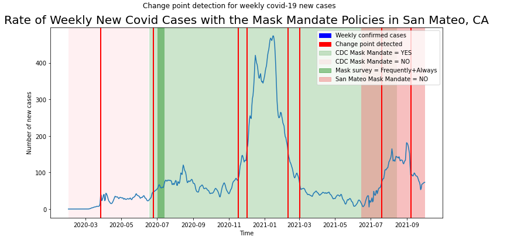

[](https://github.com/nayantaramohan/data512-course-project/blob/main/LICENSE)

# DATA 512: Human Centered Data Science (Au 2022)

## Part 1 - Common Analysis
Common Analysis sets the stage for the subsequent assignments.  
**County Assigned: San Mateo, CA**

## Goal
The goal of this assignment is to construct, analyze, and visualize covid 19 confirmed cases data of the assigned county during the given time period to answer the below research question.  
*How did masking policies change the progression of confirmed COVID-19 cases from February 1, 2020 through October 1, 2021?*

## Motivation
During the last three years we all have been experiencing a global pandemic. This has been tragic and disruptive to many countries and has taken a deep personal toll on many individuals and their families.   

One aspect that has been hard to miss in the last three years is the datafication of the pandemic. That is, many aspects of the individual toll of the pandemic have been collected, aggregated and re-represented as data. This [datafication](https://en.wikipedia.org/wiki/Datafication) gives us the privilege to examine the pandemic from potentially many different perspectives to understand how it has changed lives and how it has changed society. To be honest, we are actually at the very beginning of understanding and comprehending these impacts.  

During this Course Project you are going to begin taking a look at some of the social aspects of the pandemic by conducting a human centered data science analysis of some available COVID-19 data. In Part 1- Common Analysis, every student in the course will work from the same datasets. Students will be assigned to analyze data for one specific County of the United States.  

## Repository tree
```
.
├── input_data
│   ├── RAW_us_confirmed_cases.csv
│   ├── cdc_masking_mandates_county.csv.zip 
│   └── mask-use-by-county.csv 
├── LICENSE
├── README.md
├── common-analysis-nmohan.ipynb
└── part1_output_viz.png
```  
#### Description
- **LICENSE** : a file that contains an MIT LICENSE for nayantaramohan/data512-course-project repo.
- **common-analysis-nmohan.ipynb** : The Jupyter notebook that consists of all the code with documentation of the preprocessing, data cleaning and data visualization done to achieve the stated goal.

## Input Data & Sources
1. **RAW_us_confirmed_cases.csv**: The RAW_us_confirmed_cases.csv file from the Kaggle repository of [John Hopkins University COVID-19 data](https://www.kaggle.com/datasets/antgoldbloom/covid19-data-from-john-hopkins-university). This data is updated daily. You can use any revision of this dataset posted after October 1, 2022.
2. **cdc_masking_mandates_county.csv**: The CDC dataset of [masking mandates by county](https://data.cdc.gov/Policy-Surveillance/U-S-State-and-Territorial-Public-Mask-Mandates-Fro/62d6-pm5i). Note that the CDC stopped collecting this policy information in September 2021.
3. **mask-use-by-county.csv**: The New York Times [mask compliance survey](https://github.com/nytimes/covid-19-data/tree/master/mask-use) data.

## Special Considerations
- Daily confirmed data has been converted into Weekly data by taking a rolling average over 7 days to smoothen the curve and ensure a more effective data visualization.
- Apart from the CDC masking mandate data, San Mateo's [official website](https://www.smcgov.org/san-mateo-county-reopening) stating the masking policies have also been considered in the output visualization.

## Snapshot of Analysis Output

#### Weekly New Covid Cases with the Masking Policies in San Mateo, CA during 01 Feb 2020 - 01 Oct 2021


## Detailed Inference
The visualization shows the time series trend of the number of confirmed weekly new cases of covid-19 through the time frame of 01 Feb 2020 to 01 October 2021. This main trend line is shown in blue color, along with various background colors which are explained in detail below. A viewer can read this figure by reading the title, going through the legends and axis labels.   

There are mainly two axes. The y-axis accounts for the number of new confirmed cases in a week. The x-axis consists of time whose granularity is in weeks. The initial raw data had the data for individual days throughout the given time frame, but this data was very noisy and the overall trend/seasonality was lost in the visualization due to abrupt changes. Hence the daily data was converted into weekly by taking a mean of 7-days to represent the weekly new cases count. This also accounts for the irregularities of having lesser confirmed cases on weekends (which could be due to public holidays) and a spike in the number of cases on Mondays (which could be a result of the confirmed cases during the weekend as well). The overall representation of the trend looks much smoother after taking the rolling average.  

The trend is quite abrupt and it is difficult to model or predict what the trend could be. Hence the change point detection algorithm was done using the Pelt Algorithm. These change points have been marked on the visualization as solid red lines. For a user to understand, these change points are the instances in time where abrupt changes occur in the time series data. Hence these time intervals can be analyzed further to account for vaccination status, quarantine etc.  

For the purpose of Part 1 analysis. The mask mandate data has been used along with the confirmed cases to see if there is an effect in the number of new cases with the change in mask mandates. Two datasets (given in the assignment) and the government website of San Mateo county were used to determine the mask mandate status during the time interval. The legends are self-explanatory. The survey data from individuals who reported to wear a mask 92% of the time in San Mateo has been shown as a narrow bright green window during the first two weeks of July. It is interesting to note that the CDC mask mandate data is YES until 15 Aug 2021 but as per San Mateo’s official website the mask mandate was removed after June 2021. Thus there is an overlap of the background colors. We also see a new spike of covid wave just after the mask mandate was removed. 


## Best practices for documentation
- PEP 8 – Style Guide for Python Code ([Reference link](https://peps.python.org/pep-0008/))
- Use of relative path addresses to help in reproducibility
- Use of intuitive variable and function names to ease in understanding
- Appropriate comments and documentation provided for the data aquisition, data processing and data analysis steps
- Description of all data files present in the repository mentioned

## Author
[Nayantara Mohan](https://github.com/nayantaramohan) 
